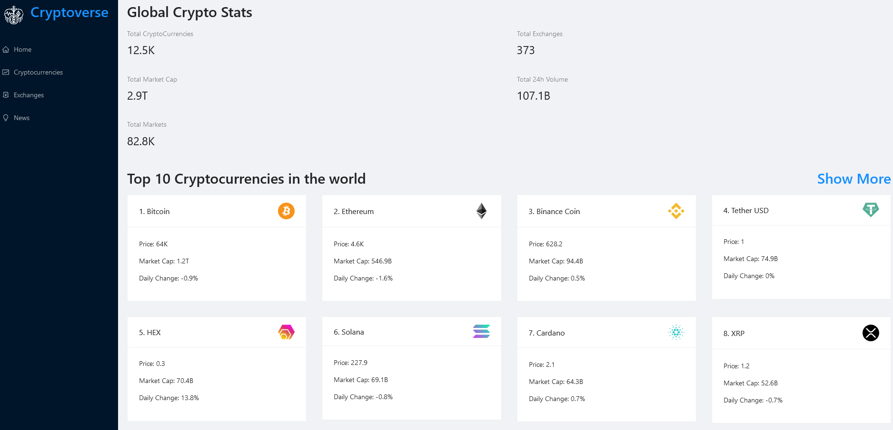

<h1  align="center">Crypto News</h1>


<p  align="center">Este projeto é um site a onde o usuário poderá ver as principais informações de mercado de todas as principais crypto moedas do mercado além de poder ver dados em tabela ao passar do tempo e ler as últimas notícias da moeda desejada
</p>



As seguintes ferramentas foram usadas na construção do projeto:
  

-  [Node.js](https://nodejs.org/en/)

-  [ant Design](https://ant.design/)

-  [ChartJS](https://www.chartjs.org/)

-  [React](https://pt-br.reactjs.org/)

-  [TypeScript](https://www.typescriptlang.org/)

  

<h2>Como inicializar o Projeto</h2>

  
```
1. git clone https://github.com/FuranoYuki/Crypto-News.git

2. cd Crypto-News
```
  

Instale as dependências usando Yarn ou NPM

  ```

3. yarn install

  ```

or

```

3. npm install

```
  

Feito a instalação das dependências você precisa já ter uma conta criada na <a  src="https://rapidapi.com/"  target="_blank">Rapidapi</a>

  
Esse projeto usa duas API do Rapidapi


<a  src="https://rapidapi.com/Coinranking/api/coinranking1/" target="_blank">Coinranking</a> para obter as informações e dados sobre as moedas.

<a  src="https://rapidapi.com/microsoft-azure-org-microsoft-cognitive-services/api/bing-news-search1/" target="_blank">Bing News Search</a> para obter as últimas notícias sobre as moedas.

  <br/>

Após isso, você precisa criar um arquivo .env na raiz do projeto com as seguintes variáveis:

  

REACT_APP_NEWS_KEY="sua key da API do Bing News Search"

REACT_APP_CRYPTO_KEY="sua key da API do Coinranking"

<br/>

Finalmente estamos prontos para roda o nosso projeto
```
npm start
```
or
```
yarn start
````
